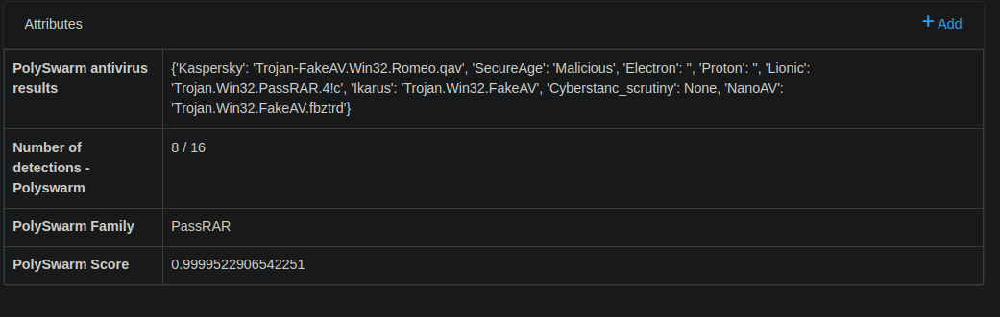

# Karton-polyswarm-Scanner

A modular [Karton Framework](https://github.com/CERT-Polska/karton) service that Scan and pull scan results from Polyswarm API and use antivirus scan results to pull family using [PolyUnite](https://github.com/polyswarm/polyunite)


*MWEB Scan Results*

**Consumes:**
```json
        {
            "type": "sample",
            "stage": "recognized",
            "kind": "runnable",
            "platform": "win32"
        }, {
            "type": "sample",
            "stage": "recognized",
            "kind": "runnable",
            "platform": "win64"
        },
        {
            "type": "sample",
            "stage": "recognized",
            "kind": "document",
            "platform": "win32"
        },
        { 
            "type": "sample",
            "stage": "recognized",
            "kind": "runnable",
            "platform": "linux"
        }
```


## Usage
You have to add the following attributes to your MWDB instance:
1-polyswarm-antivirus
2-polyswarm-detections
3-polyswarm-family
4-polyswarm-score

**Install from Docker:**
Make sure you have docker and docker-compose installed.
Update polyswarm api key in docker.compose.yml file.
update config/karton.docker.ini file
```shell
$ docker-compose up -d
```

**Install from Source:**
Make sure you have setup the core system: https://github.com/CERT-Polska/karton
Set environment variable POLYSWARM_API with your key.
```shell
$ sudo apt install -y python3-virtualenv git
$ git clone https://github.com/bormaa/karton-polyswarm-scanner.git
$ cd karton-polyswarm-scanner/
$ git clone https://github.com/polyswarm/polyunite
$ virtualenv venv/
$ source venv/bin/activate
$ pip install ./polyunite
$ pip install polyswarm_api karton-core
$ python3 -m karton.scanner
```

# Testing Your Installation

Once you have completed installing `karton-unpacker`, try uploading the file `tests/shellcode.exe` to mwdb.

If successful, you will see a file in relations with the name `unpacked`, this is the extracted shellcode to spawn `cmd.exe`.

# Contributing

If you wish to contribute your own modules to automatically unpack malware, please refer to [CONTRIBUTING.md](https://github.com/c3rb3ru5d3d53c/karton-unpacker/blob/master/CONTRIBUTING.md)